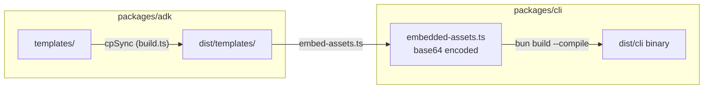
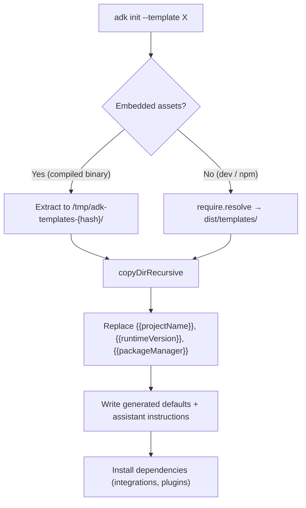

# ADK Templates

Templates for `adk init --template <name>`. Each template is a complete, runnable ADK project.

## How Templates Work

### Build Time



Templates are distributed two ways:

1. **Filesystem** — `build.ts` copies `templates/` to `dist/templates/`. Available via `require.resolve('@botpress/adk')`.
2. **Embedded** — `embed-assets.ts` base64-encodes all template files into the CLI binary. Extracted to a versioned `/tmp` dir at runtime.

### Runtime



### Placeholder Substitution

Template files use `{{placeholder}}` syntax. Three placeholders are supported:

| Placeholder          | Replaced with                           | Example  |
| -------------------- | --------------------------------------- | -------- |
| `{{projectName}}`    | The project name from `adk init <name>` | `my-bot` |
| `{{runtimeVersion}}` | Current `@botpress/runtime` version     | `1.17.0` |
| `{{packageManager}}` | Detected package manager                | `bun`    |

Text files (`.ts`, `.json`, `.md`, etc.) get substitution. Binary files are copied as-is.

### Generated Project Infrastructure

`adk init` writes shared project infrastructure unless a template provides an explicit override:

- `package.json` — common ADK scripts plus `@botpress/runtime`, `@botpress/evals`, and TypeScript dependencies
- `tsconfig.json` — strict TypeScript config with generated `.adk/*.d.ts` includes
- `.gitignore` — generated/runtime outputs and local-only files
- `CLAUDE.md` and `AGENTS.md` — assistant instructions

`agent.json` is not created during unlinked init. It is written when the project is linked to a prod bot.

## Available Templates

| Template              | Description                          | Dependencies        |
| --------------------- | ------------------------------------ | ------------------- |
| `blank`               | Empty project with placeholder files | chat, webchat       |
| `hello-world`         | Working chatbot                      | chat, webchat       |
| `botpress-desk`       | Support bot with human handoff       | chat, webchat, desk |
| `slack-triage`        | Classify + route help requests       | slack, chat         |
| `knowledge-assistant` | RAG Q&A with company docs            | chat, webchat       |
| `crm-enrichment`      | Scheduled contact enrichment         | chat                |

## Adding a New Template

1. Create a directory: `templates/<name>/`
2. Add at minimum: `agent.config.ts` and `README.md`
3. Add source files under `src/` (actions, conversations, workflows, tables, triggers, knowledge)
4. Register in `template.config.json`
5. Use `{{projectName}}`, `{{runtimeVersion}}`, `{{packageManager}}` for substitution
6. For unused primitives, use contextual commented-out examples relevant to the template's use case
7. Dependencies go in `template.config.json`'s `dependencies.integrations` field so `adk integrations add` resolves real versions
8. Only add `package.json`, `tsconfig.json`, or `.gitignore` when the template truly needs to override the generated default

### Template Structure

```
templates/<name>/
├── agent.config.ts        # Use {{projectName}}, empty integrations: {}
├── README.md              # Use {{projectName}} and {{packageManager}}
└── src/
    ├── actions/           # Real files or index.ts placeholder
    ├── conversations/     # Real files or index.ts placeholder
    ├── knowledge/         # Real files or index.ts placeholder
    ├── tables/            # Real files or index.ts placeholder
    ├── triggers/          # Real files or index.ts placeholder
    └── workflows/         # Real files or index.ts placeholder
```

### Registry (`template.config.json`)

```json
{
  "name": "my-template",
  "description": "One-line description shown in --list-templates",
  "category": "starter",
  "complexity": "intermediate",
  "dependencies": {
    "integrations": ["slack@latest"],
    "plugins": []
  }
}
```
